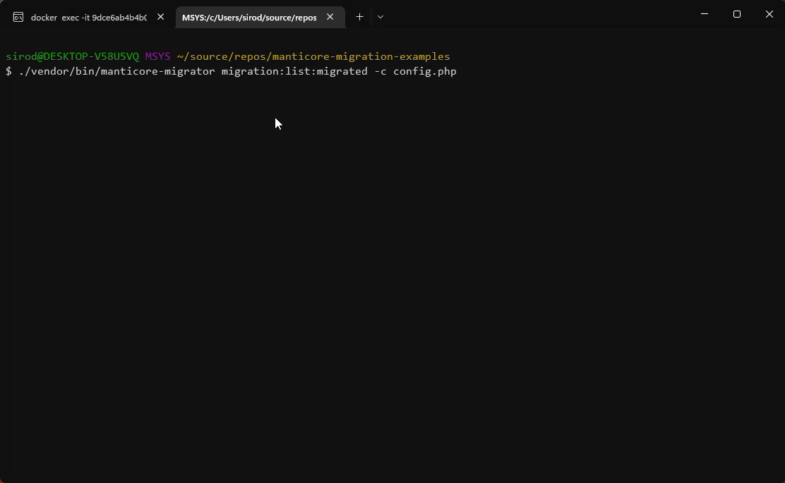

# manticore-migration

[](https://packagist.org/packages/SiroDiaz/manticore-migration)
[](https://github.com/SiroDiaz/manticore-migration/actions?query=workflow%3Atests+branch%3Amain)
[](https://github.com/SiroDiaz/manticore-migration/actions?query=workflow%3A"Check+%26+fix+styling"+branch%3Amain)
[](https://packagist.org/packages/SiroDiaz/manticore-migration)

Manticoresearch migration tool. Keep updated your index schemas up to date using a executable CLI script or integrate it programmatically in your application code.


## project progress and roadmap
  - [x] Add CI pipeline
    - [x] Add PHP versions supported
      - [x] 7.4
      - [x] 8.0
      - [x] 8.1
    - [x] PhpStan
    - [x] PHPUnit run tests
  - Pre-commit linter and tests checks
    - [x] Add Grumphp
      - [x] PHPStan
      - [x] PHPUnit
  - [ ] Add a logger implementation
  - [x] Add docker-compose stack files for testing and development
  - [ ] Add code documentation
  - [ ] Write a complete README file explaining all
  - [ ] Add unit and integration tests
  - [x] Add command line interface feature
    - [x] Add cli application metadata such as name, description, etc.
    - [x] Created structure of the CLI application
  - [x] Executable script (bin/manticore-migration)
  - [ ] Add commands
    - [x] list
    - [ ] make:config
    - [x] make:migration
    - [x] migration:list:pending
    - [x] migration:list:migrated
    - [x] migrate
    - [x] rollback
    - [ ] rollback with --steps
    - [x] fresh
    - [ ] refresh
    - [ ] refresh with --steps
    - [ ] reset
    - [ ] status
    - [x] help
  - [x] Add drivers to support multiple DBs engines dialects
    - [x] Add driver for SQLite
    - [x] Add driver for MySQL
    - [x] Add driver for PostgreSQL
  - [ ] Create a Laravel package
  - [ ] Create a Symfony package
## Installation

```sh
composer require sirodiaz/manticore-migration
```

## Usage
First of all, you need to install the package.

```sh
composer require sirodiaz/manticore-migration
```

After been installed, you need to create a directory.
That directory will contain the migration files sorted by creation date.

You have two different ways to use this package:

  - programmatically
  - CLI

You can create your own integration with `manticore-migration` using the programmatically way as you can see in hte **examples** directory in this repository.

In each section of these documentation you will see both: programmatically and CLI version to create, migrate, rollback, list applied and pending migrations.
### Create migration

#### CLI
To create a migration file you have to use the make:migration and the class name (the migration class name that extends Migration class) using
snake_case_style.
This class name should be a descriptive name. It's better a long name for two reasons:
  - to better understand what the migration does
  - and for avoid duplicated class names
```sh
./vendor/bin/manticore-migration make:migration -c config.php create_products_index
```

#### programmatically

```php
<?php

```


### Apply migrations


#### CLI

There are two available commands for apply pending migrations using the Command Line Interface

```sh
./vendor/bin/manticore-migration migrate -c config.php
```

```sh
./vendor/bin/manticore-migration migrate:up -c config.php
```

#### programmatically

```php
<?php

```

### Rollback migration


#### CLI

There are two available commands to rollback applied migrations using the Command Line Interface

```sh
./vendor/bin/manticore-migration rollback -c config.php
```

```sh
./vendor/bin/manticore-migration migrate:down -c config.php
```

#### programmatically

```php
<?php

```
### List migrations applied history


#### CLI

For list pending migrations using the Command Line tool

```sh
./vendor/bin/manticore-migration migration:list:pending -c config.php
```
#### programmatically

```php
<?php

```

### List pending migrations


#### CLI

For list pending migrations using the Command Line tool

```sh
./vendor/bin/manticore-migration migration:list:pending -c config.php
```
#### programmatically

```php
<?php

```
